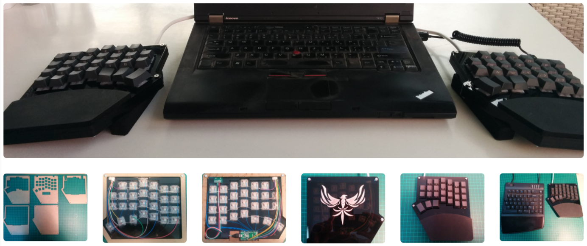
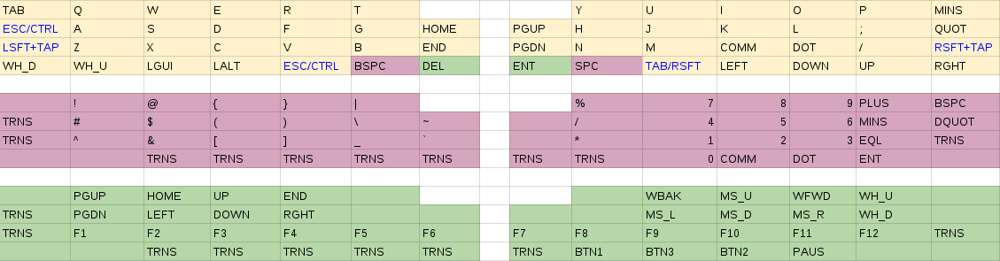

# Hand wired 54key full split mechanical keyboard

To cut a long story short, I started feeling pain in my wrists and
shoulders in Dec 2014. I did some research into ergonomic keyboards,
bought a Kinesis Freestyle, got sucked into the mechanical keyboard
scene, hand wired a test [8key](https://goo.gl/photos/TbPSDzrhXfg9XMT2A) keyboard from switch tester, sourced
and hand wired an [Atreus](https://goo.gl/photos/kjKC2Xvuuc4AcfrSA), ordered an Infinity Ergodox but the wait
and delays were killing me, so I designed and built my own, codenamed
*blackhawk*.

[High resolution photos](https://goo.gl/photos/pkQY3UJtp5hR5mas7)

## Design goals

- **Fully programmable** - multi-layer keymaps, mouse keys, oneshot modifiers, macros, ...
- **Full split with laptop wide separation** - most comfortable hand positioning I've found
- **Non-staggered columns** - human fingers don't move diagonally
- **Staggered rows** - human fingers have different lengths
- **Just enough keys you can reach** - no stretching, no hand movement
- **Multiple thumb keys** - pity to waste two thumbs on just one key
- **Trackpoint on home-row** - great mouse at your finger tip ([guide](https://github.com/alonswartz/trackpoint))
- **Tactile mechanical switches** - once you go mechanical, you can't go back
- **Full hand with integrated wrist rests** - mobility and tenting
- **Small, minimal and compact** - mobility

## Keymap layout

## Parts

- Gateron brown switches
- Teensy 2.0 micro-controller
- USB type-c breakout board
- USB type-c to USB A short coiled cable
- Interconnect 11 conductor cable
- Vortex PBT cherry keycaps
- Grafiti skin surface slim wrist rest
- 3mm hex bolts and nuts
- Trackpoint module and 16G labret for stem

## Case

- Laser cut transparent gray acrylic 3mm 5 layer sandwitch case
- Ponoko ready-to-cut P3 design file available in `case/`
- Note: the original design called for USB type-c interconnect, but due
  to a defective cable with [current leakage](https://deskthority.net/workshop-f7/hand-wired-54key-full-split-custom-build-t12545.html#p372473), I opted for a fixed
  interconnect, so the breakout board cutout is no longer required.

## Inspiration and thanks

- My wife - for putting up with me and my new obsession
- Matt3o - for the excellent tutorials
- TMK - for the amazingly powerful open source keyboard firmware
- Suka - for the inspiring builds
- Technomancy - for the Atreus
- Jacobolus - for the great riff designs
- Lister - for the sandwitch plate case design
- Ponoko - for great service and customer support
- Massdrop - for taking so long with the Infinity Ergodox
- Geekhack and Deskthority communities

